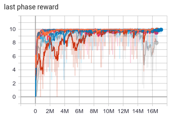
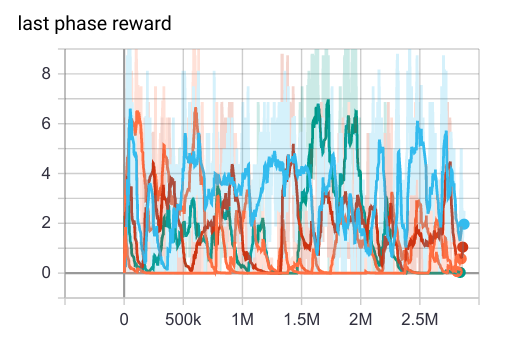

# TVT: Temporal Value Transport

An open source implementation of agents, algorithm and environments related to
the paper [Optimizing Agent Behavior over Long Time Scales by Transporting Value](https://arxiv.org/abs/1810.06721).

## Installation

TVT package installation and training can run using: `tvt/run.sh`. This will use
all default flag values for the training script `tvt/main.py`. See the section
on running experiments below for launching with non-default flags.

Note that the default installation uses tensorflow without gpu. Replace
`tensorflow` by `tensorflow-gpu` in `tvt/requirements.txt` to use tensorflow
with gpu.

## Differences between this implementation and the paper

In the paper agents were trained using a distributed A3C architecture with
384 actors. This implementation runs a batched A2C agent on a single gpu machine
with batch size 16.

## Tasks

### Pycolab tasks

In order for this to train in a reasonable time on a single machine, we
provide 2D grid world versions of the paper tasks using Pycolab, to replace
the original DeepMind Lab 3D tasks.

Further details of the tasks are given in the Pycolab directory README and users
can also play the tasks themselves, from the command line.

Special thanks to Hamza Merzic for writing the two Pycolab task scripts.

### DeepMind Lab tasks

The DeepMind Lab tasks used in the paper are also provided as part of this
release.

Further details of specific tasks are given in the DeepMind Lab directory
README.

## Running experiments

### Launching

To start an experiment, run:

```
source tvt_venv/bin/activate
python3 -m tvt.main
```

This will launch a default setup that uses the RMA agent on the 'Key To Door'
Pycolab task.

### Important flags
`tvt.main` accepts many flags.

Note that all the default hyperparameters are tuned for the TVT-RMA agent to
solve both `key_to_door` and `active_visual_match` Pycolab tasks.

#### Information logging:
`logging_frequency`: frequency of logging in console and tensorboard. <br>
`logdir`: Directory for tensorboard logging. <br>

#### Agent configuration:
`with_memory`: default True. Whether or not agent has external memory. If set to
False, then agent has only LSTM memory.<br>
`with_reconstruction`: default True. Whether or not agent reconstructs the
observation as described in Reconstructive Memory Agent (RMA) architecture.<br>
`gamma`: Agent discount factor.<br>
`entropy_cost`: Weight of the entropy loss. <br>
`image_cost_weight`: Weight of image reconstruction loss.<br>
`read_strength_cost`: Weight of the memory read strength. Used to regularize the
memory acess.<br>
`read_strength_tolerance`: The tolerance of hinge loss for the read strengths.
<br>
`do_tvt`: default True. Whether or not to apply the Temporal Value Transport
Algorithm (only works if the model has external memory).<br>

#### Optimization:
`batch_size`: Batch size for the batched A2C algorithm.<br>
`learning_rate`: Learning rate for Adam optimizer.<br>
`beta1`: Adam optimizer beta1.<br>
`beta2`: Adam optimizer beta2.<br>
`epsilon` Adam optimizer epsilon.<br>
`num_episodes` Number of episodes to train for. None means run forever.<br>

#### Pycolab-specific flags:
`pycolab_game`: Which game to run. One of 'key_to_door' or
'active_visual_match'. See pycolab/README for description.<br>

`pycolab_num_apples`: Number of apples to sample from.<br>
`pycolab_apple_reward_min`: The minimum apple reward.<br>
`pycolab_apple_reward_max`: The maximum apple reward.<br>
`pycolab_fix_apple_reward_in_episode` default True. This fixes the sampled apple
reward within an episode.<br>
`pycolab_final_reward`: Reward obtained at the last phase.<br>
`pycolab_crop`: default True. Whether to crop observations or not.<br>


### Monitoring results

Key outputs are logged to the command line and to tensorboard logs.
We can use [tensorboard](https://www.tensorflow.org/guide/summaries_and_tensorboard)
to track the learning progress if FLAGS.logdir is set.<br>
```
tensorboard --logdir=<logdir>
```
<br>
Key values logged:
`reward`: The total rewards agent acquired in an episode. <br>
`last phase reward`: The critical reward acquired in the exploit phase, which
depends on the behavior in the exploring phase.<br>
`tvt reward`: The total fictitious rewards generated by the Temporal Value
Transport algorithm.<br>
`total loss`: The sum of all losses, including policy gradient loss, value
function loss, reconstruction loss, and memory read regularization loss. We also
log these losses separatedly.

## Example results

Here we show the example results of running the TVT agent (with the default
hyperparameters) and the best control RMA agent (with `do_tvt=False, gamma=1`).

Since TVT is designed to reduce the variance in signal for learning rewards that
are temporally far from the actions or information that lead to those rewards,
in the paper we focus on the reward in the last phase of each task, which is
the only reward that depends on actions or information from much earlier in the
task than the time at which the reward is given. In the experiments here, the
best way to track if TVT is working is by monitoring the `last phase reward`
as this is the critical performance we are interested in - the agent with TVT
and the control agents are doing well in the apple collecting phase, which
contributes most of the episodic rewards, but not in the last phase.

### Key-to-door
Across 10 replicas, we found that the TVT agents get to a score of 10,
meaning they reliably collected the key in the explore phase to open the door in
the exploit phase.<br>
# 
For 10 replicas without TVT and with the same hyperparameters, we see consistent
low performance.<br>
# 
For 5 replicas with gamma equal to 1, performance of the RMA agent without TVT
is improved, but is unstable and never goes above 7.<br>
# 

### Active-visual-match
Across 10 replicas, we found that the TVT agents get to a score of 10,
meaning they reliably searched for the pixel and remembered its color in the
explore phase, and then touched the corresponding pixel in the exploit
phase.<br>
# 
For 10 replicas without TVT and with the same hyperparamters, performance is
better than chance level but not at the maximum level, indicating that it is not
able to actively seek for information in the explore phase and instead must rely
on randomly encountering the information.<br>
# 
For 5 replicas with gamma equal to 1, performance of the RMA agent without TVT
is considerably worse, suggesting the behavior learnt from later phases does not
result in undirected exploration in the first phase.
# 

## Citing this work

If you use this code in your work, please cite the accompanying paper:

```
@article{
  author    = {Chia{-}Chun Hung and
               Timothy P. Lillicrap and
               Josh Abramson and
               Yan Wu and
               Mehdi Mirza and
               Federico Carnevale and
               Arun Ahuja and
               Greg Wayne},
  title     = {Optimizing Agent Behavior over Long Time Scales by Transporting Value},
  journal   = {Nat Commun},
  volume    = {10},
  year      = {2019},
  doi       = {https://doi.org/10.1038/s41467-019-13073-w},
}
```

## Disclaimer

This is not an officially supported Google or DeepMind product.
