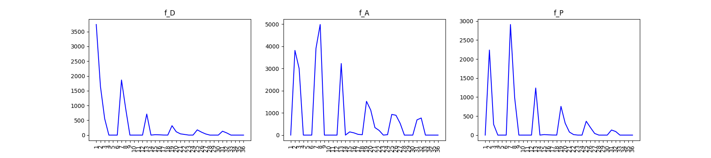

# 基本实验

## minimaze

to get the basic env and the stochastic character :

\# python -m baselines.GIPI.minimaze

+ 要能表现各个定义的特点

\# python -m baselines.GIPI.State_Im_MAZE

+ 三个小图分别表示各自的特点，注意f_D是反比

\# python -m baselines.GIPI.maze_env20

+ 基本场景

\# python -m baselines.GIPI.UptrendStateValueRL_v4

